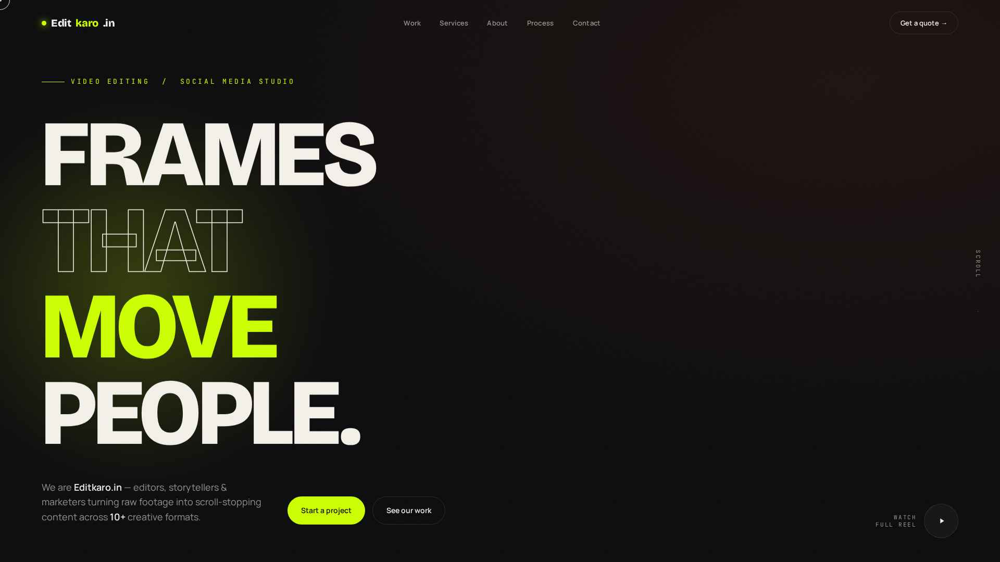
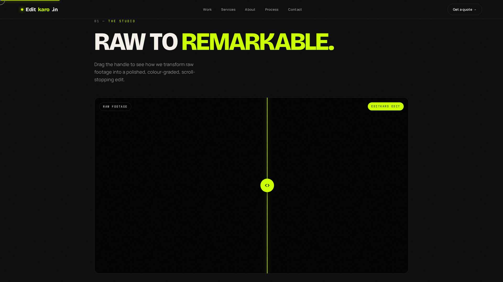
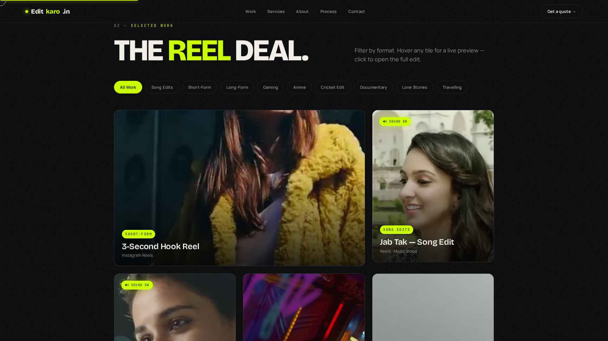
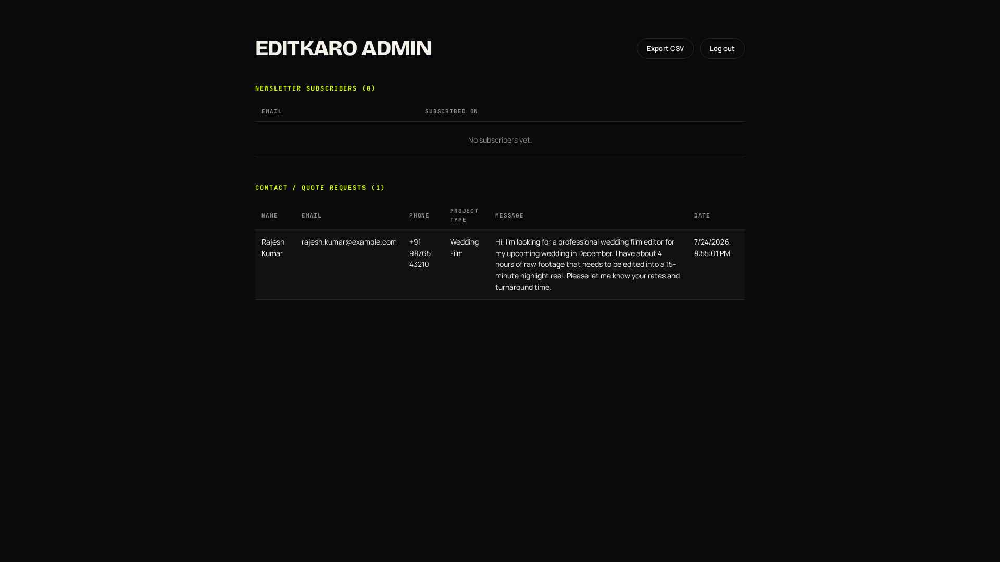

# Editkaro.in — Video Editing Portfolio Website

A single-page portfolio website for **Editkaro.in**, a video editing & social media marketing
studio. The site showcases the studio's work, services and team, lets visitors subscribe to a
newsletter or send a project enquiry, and gives the studio owner a private dashboard to view
everything that's been submitted.

**🔗 Live Website:** https://edit-kro-psi.vercel.app/
**🔗 Admin Dashboard:** https://edit-kro-psi.vercel.app/admin.html *(login required — for the studio owner only)*

---

## Preview

### Hero


### Before / After Drag Slider
Visitors can drag a handle to compare the raw footage against the final Editkaro edit.



### Portfolio Grid
A filterable grid of past edits — hover to preview, click to watch in a lightbox.



### Admin Dashboard
A private page where the studio owner can see every newsletter signup and contact request.



---

## Tech Stack

| Layer     | Technology |
|-----------|------------|
| Frontend  | Plain HTML5, CSS3, vanilla JavaScript (no frameworks) |
| Backend   | FastAPI (Python) |
| Database  | MongoDB (MongoDB Atlas in production) |
| Auth      | JWT bearer tokens (for the admin dashboard only) |
| Hosting   | Vercel (frontend + backend deployed together as one project) |

## Project Structure

```
frontend/
  public/
    index.html      -> main website markup
    style.css        -> all styling
    script.js        -> all interactivity (filters, lightbox, forms, animations)
    admin.html       -> admin dashboard (login + data tables)
    videos/          -> portfolio video clips
backend/
  server.py          -> FastAPI app: subscribe/contact APIs + admin auth
  requirements.txt
vercel.json          -> deployment config (frontend + backend as two Vercel services)
```

## How the Website Works

The frontend is a single HTML page (`index.html`) with these sections, all built with plain
CSS/JS — no React, no build step required to view it:

1. **Hero** — intro tagline with a showreel button
2. **Studio** — the before/after drag slider comparing raw footage to the final edit
3. **Work** — filterable portfolio grid (Short-Form, Long-Form, Song Edits, Gaming, Anime,
   Cricket, Documentary, Love Stories, Travelling) with hover previews and a video lightbox
4. **Services** — Video Editing, Color Grading, Audio Enhancement, Social Media Marketing,
   Motion Graphics, Content Strategy
5. **Stats** — projects shipped, happy creators, views generated, creative formats
6. **About + Team** — studio mission and a team grid
7. **Testimonials** — client feedback
8. **Process** — the 4-step workflow (Discovery, Story, Edit, Deliver)
9. **Newsletter** — email signup, saved to the database
10. **Contact** — project enquiry form (name, email, phone, project type, message), saved to
    the database
11. **Footer** — brand, quick links, contact details

## Backend

The backend is a small **FastAPI** app (`backend/server.py`) that does three things:

1. **Public forms API** — receives newsletter signups and contact/quote requests from the
   website and stores each one as a document in MongoDB (`subscribers` and `contact_messages`
   collections). No login needed to submit these — anyone visiting the site can.
2. **Admin authentication** — a single admin account (seeded into MongoDB on startup from
   environment variables) can log in and receive a **JWT token**. Failed login attempts are
   rate-limited (5 attempts → 15 minute lockout per IP + username) to prevent brute-forcing.
3. **Admin data API** — protected endpoints that return the stored subscribers and contact
   requests, used by `admin.html` to render its tables. These require a valid JWT token in the
   `Authorization` header — without it, the API returns `401 Unauthorized`.

### API Endpoints

| Method | Endpoint                       | Description                              | Auth required |
|--------|----------------------------------|-------------------------------------------|----------------|
| POST   | `/api/subscribe`                | Add an email to the newsletter list       | No |
| POST   | `/api/contact`                  | Submit a project enquiry                  | No |
| POST   | `/api/auth/login`               | Admin login, returns a JWT token          | No |
| GET    | `/api/auth/me`                  | Get the logged-in admin's identity        | Yes |
| GET    | `/api/admin/subscribers`        | List all newsletter subscribers           | Yes |
| GET    | `/api/admin/contact-messages`   | List all contact/quote requests           | Yes |

## Admin Dashboard

The admin dashboard (`/admin.html`) is a private page for the studio owner — it is
**intentionally not linked anywhere on the public site**, so regular visitors never see it.

- Log in with an admin username + password.
- Once logged in, you see two live tables pulled straight from the database:
  - **Newsletter Subscribers** — every email that's signed up, with the date they subscribed.
  - **Contact / Quote Requests** — every enquiry submitted through the contact form, with
    name, email, phone, project type, message and date.
- An **"Export CSV"** button downloads all of this data as a spreadsheet.
- A **"Log out"** button clears the session.

Login credentials are configured through environment variables on the server (`ADMIN_USERNAME`,
`ADMIN_PASSWORD`) — they are never stored in the source code, so they aren't included in this
README either. If you need the login details, ask whoever manages this project's deployment.

## Running Locally

**Backend**
```
cd backend
pip install -r requirements.txt
```
Create a `.env` file in `backend/` with:
```
MONGO_URL=<your MongoDB connection string>
DB_NAME=editkaro_db
CORS_ORIGINS=*
JWT_SECRET=<a random secret string>
ADMIN_USERNAME=<choose an admin username>
ADMIN_PASSWORD=<choose an admin password>
```
Then start the server:
```
uvicorn server:app --host 0.0.0.0 --port 8001
```

**Frontend**

Serve the `frontend/public` folder with any static file server, or open `index.html` directly.
All API calls from `script.js` and `admin.html` are made to relative `/api/...` paths, so the
backend must be reachable at `/api` from wherever the site is served.

## Deployment

This project is deployed on **Vercel** as two services in one project — see `vercel.json`:
- `frontend` — the static site (Create React App preset, though the actual app served is the
  plain HTML/CSS/JS in `frontend/public`)
- `backend` — the FastAPI app, reachable at `/api/*`

MongoDB is hosted on **MongoDB Atlas** since Vercel doesn't provide persistent database hosting.
